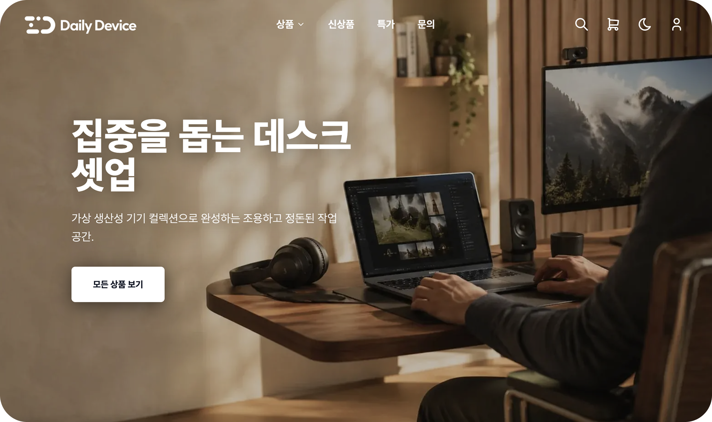
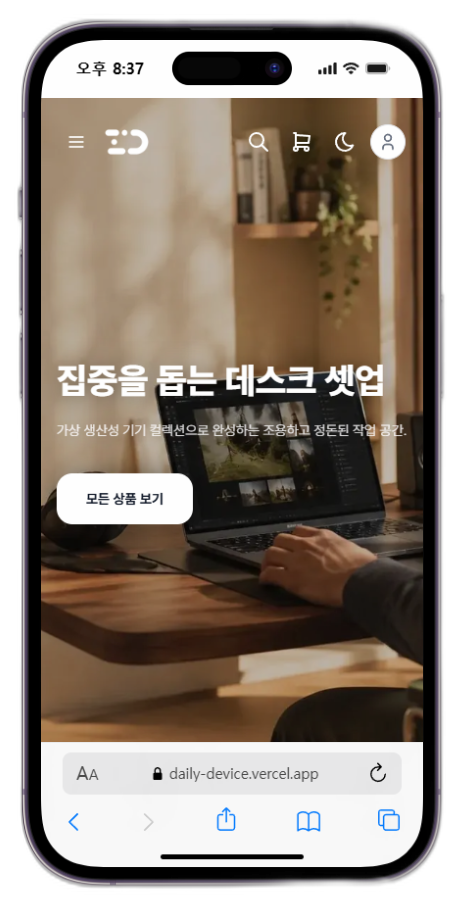

# Daily Device

Next.js App Router 기반 이커머스 포트폴리오 프로젝트입니다. 상품 탐색부터 장바구니, 체크아웃, 주문·상품평 관리와 관리자 페이지까지 하나의 흐름으로 구현했습니다.

[](https://github.com/gyujin7166/daily-device/actions/workflows/quality.yml)
[](https://github.com/gyujin7166/daily-device/actions/workflows/e2e.yml)
[](https://github.com/gyujin7166/daily-device/actions/workflows/chromatic.yml)

> 포트폴리오 목적의 데모 서비스로 실제 상품 판매·배송·결제는 이루어지지 않습니다. Toss Payments 테스트 결제 환경을 사용하며, 데모에는 실제 개인정보를 입력하지 않는 것을 권장합니다.

## 데모

- 배포 사이트: https://daily-device.vercel.app
- 관리자 페이지: https://daily-device.vercel.app/admin
- Storybook: https://main--6a82c7831d958c38f95c9b50.chromatic.com/
- 로그인: 로그인 페이지의 **데모 로그인** 버튼 사용

데모 계정은 상품과 콘텐츠를 확인하고 관리자 페이지를 읽기 전용으로 조회할 수 있습니다. DB의 `User.role`이 `ADMIN`인 계정만 관리자 페이지에서 추가·수정·삭제할 수 있습니다.

## 기술 스택

- **Frontend:** Next.js 16, React 19, TypeScript, Tailwind CSS v4
- **상태·폼:** TanStack Query v5, Zustand v5, React Hook Form v7, Zod
- **서버·데이터:** Next.js Route Handlers, Prisma, TiDB / MySQL
- **인증·국제화:** Auth.js (NextAuth v5), next-intl
- **외부 서비스:** Vercel, Cloudinary, Toss Payments
- **검증:** Vitest, React Testing Library, MSW, Storybook, Chromatic, Playwright, GitHub Actions

## 주요 기능

- **상품 탐색**
  - 카테고리별 상품 목록과 상세, 검색·필터·정렬, 추천 검색어와 무한 스크롤
  - 색상 선택에 따른 이미지 전환, 추천 상품, `localStorage` 기반 최근 본 상품
- **구매 흐름**
  - 회원·비회원 장바구니와 바로 구매, 배송지 선택, 주문 생성, Toss Payments 테스트 결제
  - 주문 목록·상세, 주문 취소, 배송 완료와 결제 대기 주문 만료 처리
- **사용자 기능**
  - Daum 우편번호 검색을 포함한 배송지 등록·수정·삭제, 찜 추가·삭제와 전체 비우기
  - 상품평 작성·수정, 평점 분포, 이미지 갤러리와 도움 여부 피드백, 마이페이지
- **콘텐츠와 UI**
  - 한국어·영어 UI와 상품 콘텐츠, locale 기반 라우팅, 다크모드
  - 상품·Hero·상품평 이미지 업로드, Cloudinary 변환 URL과 fallback 이미지 처리
- **인증과 관리자**
  - 소셜 로그인과 데모 로그인, 일반 계정의 관리자 페이지 읽기 전용 접근
  - Hero·상품·홈 섹션·홈 카드의 추가·수정·삭제, 상품평 공개/숨김, `ADMIN` 쓰기 권한

## 주요 화면

| 화면       | 경로                                                              | 구현 내용                                |
| ---------- | ----------------------------------------------------------------- | ---------------------------------------- |
| 메인       | `/`                                                               | Hero, Featured, Categories, 홈 카드 섹션 |
| 상품 탐색  | `/products`, `/products/discounts`, `/products/[category]`        | 카테고리, 필터, 정렬, 무한 스크롤        |
| 검색       | `/search`                                                         | 검색어 기반 결과와 추천 검색어           |
| 상품 상세  | `/products/[category]/[slug]`                                     | 색상별 이미지, 상품평, 추천 상품         |
| 체크아웃   | `/checkout`                                                       | 배송지 선택, 주문 생성, 테스트 결제      |
| 마이페이지 | `/my`, `/my/orders`, `/my/wishlist`, `/my/address`, `/my/reviews` | 주문·배송지·찜·상품평 관리               |
| 관리자     | `/admin`                                                          | Hero, 상품, 홈 콘텐츠, 상품평 관리       |

| 메인 PC 화면                                    | 메인 모바일 화면                                   |
| ----------------------------------------------- | -------------------------------------------------- |
|  |  |

## 설계 및 구현

- **App Router와 FSD:** 루트 `app/`은 route와 metadata를 연결하는 엔트리로 사용합니다. 페이지 조합과 기능 로직은 `src/pages → widgets → features → entities → shared` 방향으로 분리하고, route와 무관한 서버 조회만 페이지 레이어에서 서비스로 가져옵니다.
- **정적·동적 렌더링:** 홈과 공개 상품 화면은 정적 생성·ISR을 사용합니다. 공통 layout에서 사용자별 인증 조회를 분리하고, 체크아웃·마이페이지·관리자처럼 권한과 요청 시점 데이터가 필요한 영역은 동적으로 처리했습니다.
- **TanStack Query 서버 상태:** 상품 상세의 상품·이미지·상품평·추천 데이터를 서버에서 prefetch한 뒤 hydration합니다. 도메인별 query key와 무효화 범위를 나누고, 장바구니 수량과 찜 변경에는 실패 시 롤백하는 낙관적 업데이트를 적용했습니다.
- **Zustand 클라이언트 상태:** 장바구니·체크아웃·상품 필터·공통 UI 상태를 기능별 store로 분리했습니다. 서버 데이터는 TanStack Query에 남기고, 비회원 장바구니만 `persist` middleware와 `localStorage`로 유지합니다.
- **폼과 서버 검증:** React Hook Form과 Zod로 배송지·상품평·관리자 폼의 상태와 입력 검증을 구성했습니다. route param·query string·request body와 상품평 작성 권한·주문 상태 같은 규칙은 Route Handler에서 최종 확인합니다.
- **국제화:** next-intl의 한국어·영어 UI 메시지와 Prisma의 locale별 DB 콘텐츠를 구분했습니다. URL·API·TanStack Query key·prefetch와 hydration에서도 같은 locale을 사용합니다.
- **테스트 전략:** Vitest·RTL·MSW로 로직과 API 상태별 UI를 검증하고, Storybook·Chromatic으로 컴포넌트 상태·interaction·접근성을 확인합니다. Playwright는 로그인부터 테스트 결제와 주문 확인까지 핵심 흐름을 담당합니다.
- **이미지 처리:** Cloudinary에서 용도별 resize·`q_auto`·`f_auto` 변환을 적용합니다. Cloudinary URL은 조건부로 Vercel Image Optimization을 건너뛰고, 그 밖의 이미지는 기존 `next/image` 최적화를 유지합니다.

구조를 바꾸며 내린 판단과 운영 중 해결한 문제는 [RETROSPECTIVE.md](./RETROSPECTIVE.md)에 자세히 정리했습니다.

## 프로젝트 구조

```txt
app/                  App Router 엔트리
src/app/              Provider와 API Route 구현
src/pages/            페이지 단위 화면 조합
src/widgets/          여러 페이지에서 쓰는 큰 UI
src/features/         사용자 기능과 상호작용
src/entities/         도메인 타입·API·상태
src/shared/           공용 UI·유틸·설정
messages/             한국어·영어 UI 메시지
prisma/               Prisma schema와 seed
.storybook/            Storybook 전역 설정
.github/workflows/     품질 검사, E2E, Chromatic workflow
```

## 로컬 실행

Node.js 24.x가 필요합니다. 버전 기준은 `.nvmrc`와 `package.json`의 `engines`에 맞춥니다.

```bash
npm install
cp .env.example .env.local
```

`.env.local`에는 DB, Auth와 사용할 기능의 Cloudinary·Toss Payments 설정이 필요합니다. 실제 Secret은 저장소에 포함하지 않으며, 브라우저 번들에 노출되는 `NEXT_PUBLIC_*` 변수에는 Secret을 넣지 않습니다. 전체 변수와 placeholder는 `.env.example`에서 확인할 수 있습니다.

비어 있는 개발 DB를 사용할 때만 아래 명령으로 스키마와 기본·번역 seed를 준비합니다. `DATABASE_URL`이 가리키는 DB를 직접 변경하므로 운영 DB에는 실행하지 않습니다. 이미 준비된 개발 DB라면 이 단계는 생략할 수 있습니다.

```bash
npx prisma db push
npm run db:seed
npm run db:seed:i18n
npm run dev
```

앱은 `http://localhost:3000`에서 확인할 수 있습니다.

## 국제화

지원 locale의 단일 기준은 `src/shared/config/i18n/routing.ts`입니다. 기본 locale은 한국어이며 한국어 URL에는 접두사를 붙이지 않고, 영어 URL은 `/en`을 사용합니다.

- UI 메시지: `messages/ko.json`, `messages/en.json`
- 상품·카테고리·Hero 등 콘텐츠: Prisma locale별 번역 모델
- 요청별 메시지와 locale 링크: `src/i18n/request.ts`, `src/shared/lib/i18n/navigation.ts`

UI 카탈로그의 key와 ICU placeholder 일치 여부를 테스트하고, DB 콘텐츠를 포함한 API 응답에도 요청 locale을 전달합니다.

## Storybook과 테스트

Storybook에서는 주요 컴포넌트의 상태·interaction·접근성을 독립적으로 확인합니다. API가 필요한 스토리는 MSW fixture를 사용합니다.

```bash
npm run storybook
npm run test:storybook
npm run build-storybook
```

개발 서버는 `http://localhost:6006`에서 열립니다. Storybook 접근성 검사는 각 Story를 Chromium의 light/dark theme으로 실행하며, push 후에는 Chromatic 배포본에서 시각적 변경과 `play` interaction을 확인합니다.

테스트는 다음 범위로 나눴습니다.

- **Vitest / React Testing Library:** 순수 로직, hook, 사용자에게 보이는 컴포넌트 상태와 상호작용
- **MSW:** 장바구니·찜·주문 등 API의 성공·실패·빈 응답을 포함한 클라이언트 통합 흐름
- **Storybook / Chromatic:** 주요 variant, interaction, light/dark 접근성과 시각적 변경
- **Playwright:** Chromium에서 로그인, 상품 탐색, 장바구니부터 테스트 결제와 주문 확인까지의 핵심 흐름

| 명령어                    | 범위                                   |
| ------------------------- | -------------------------------------- |
| `npm run test:unit`       | 단위·컴포넌트·클라이언트 통합 테스트   |
| `npm run test:storybook`  | Storybook light/dark 접근성 검사       |
| `npm run test:e2e`        | Playwright Chromium 핵심 사용자 흐름   |
| `npm run test:visual`     | `@visual` 태그가 붙은 시각 회귀 테스트 |
| `npm run build-storybook` | 정적 Storybook build                   |

## CI/CD

| 시점               | 검증과 배포                                                                                   |
| ------------------ | --------------------------------------------------------------------------------------------- |
| Pull request       | format·unit·type·lint, Storybook build·접근성, production build, Chromium E2E, Vercel Preview |
| Branch push        | Chromatic Storybook 배포와 시각적 변경·interaction 검사                                       |
| `main` 브랜치 반영 | 품질 검사와 E2E 재실행, Vercel Production 배포                                                |

E2E는 운영 DB와 분리된 전용 테스트 DB의 스키마와 seed를 준비한 뒤 실행합니다. 로컬과 Vercel build는 공개 상품 경로 전체를 생성하고, GitHub Actions의 E2E build만 대표 경로로 범위를 줄입니다. 이 과정의 정적 생성 병목과 DB 연결 안정화는 [회고](./RETROSPECTIVE.md#github-actions-정적-생성-병목-개선)에 기록했습니다.

## 검증 명령

```bash
npm run format:check
npm run test:unit
npx tsc --noEmit
npm run lint
npm run build
```
